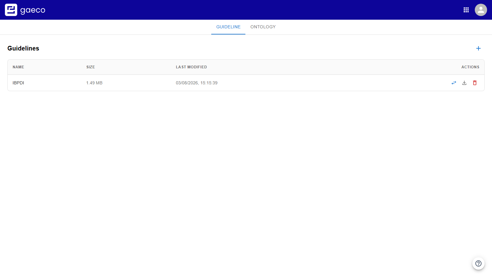
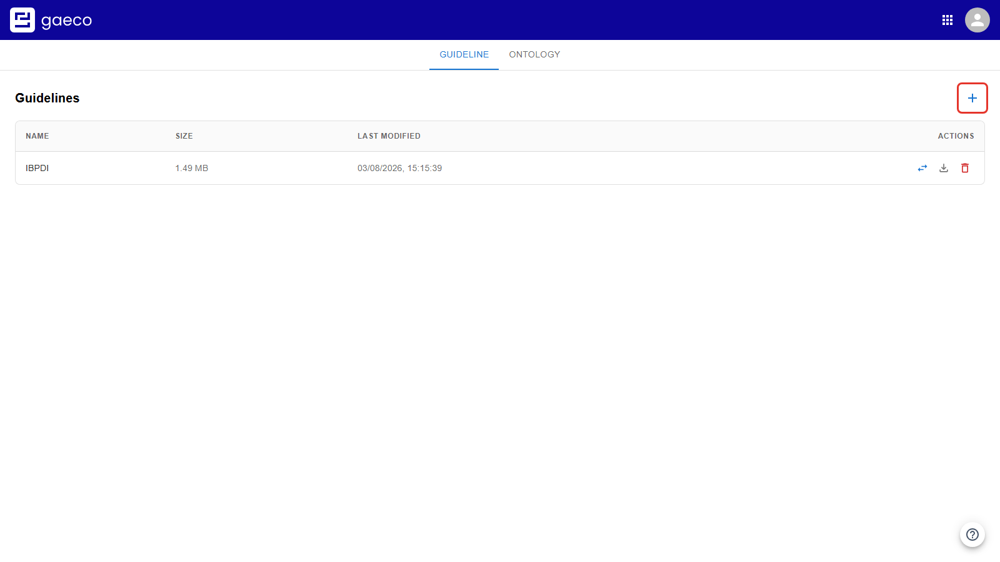
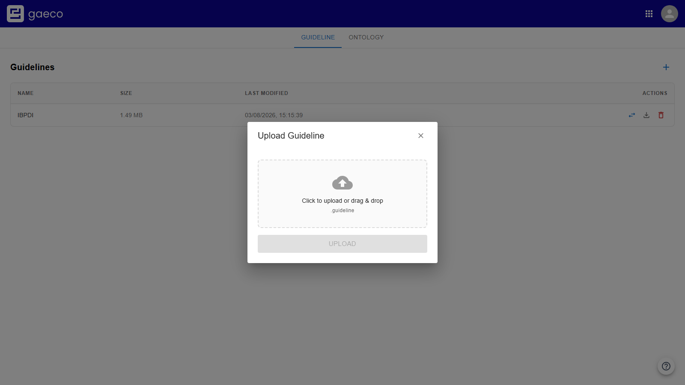
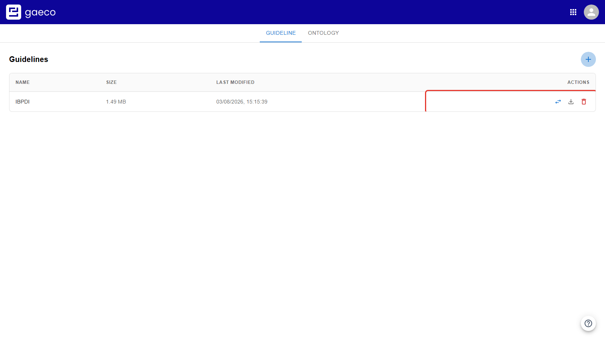
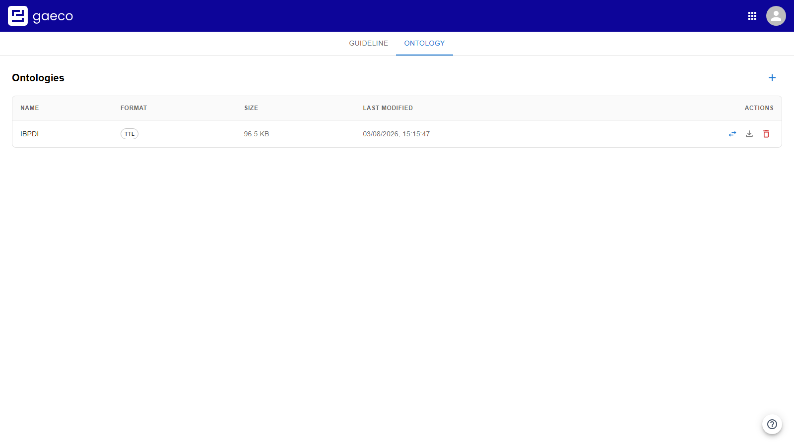
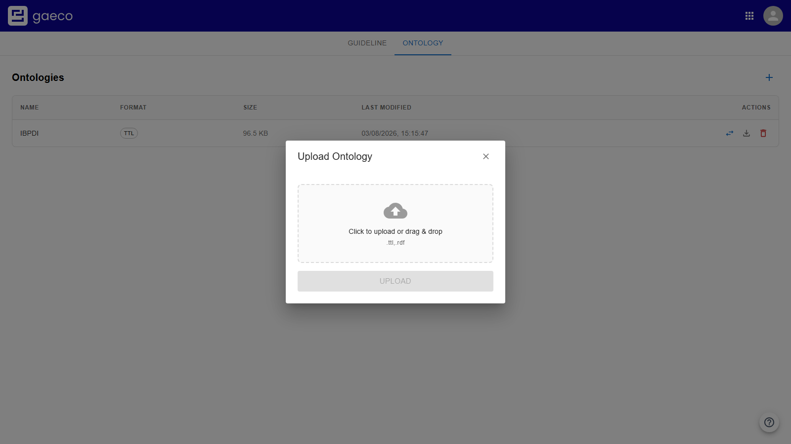

# Introduction

This document guides you through the Platform Config module: where the shared data model of a
gaeco platform is managed.

Everything in gaeco refers to that model. It decides which kinds of object exist and how they
may be connected, and it is made of two files that are uploaded here:

- a **guideline** — the classifications you work with (portfolio, building, floor, space) and
  the properties each of them carries;
- an **ontology** — which relationships are permitted between those classifications, for
  example that a building has floors.

Uploading both is the first of the three steps the
[start page](https://github.com/gaeco-ekkodale/Homepage) asks for. Nothing else in the
platform can be configured before it is done: access rights are granted for properties the
guideline declares, and instances can only exist for classifications it declares.

# Prerequisites

- The `PlatformConfig Client` must be running as a plugin inside the Plugin Host.
- The following services must be running:
  - `MiniO` — the uploaded files are stored there
  - `Kafka` — the contents are published to the other services
  - `PluginHost Service`
  - `AppOrchestrator`
  - `Guideline Service`
  - `Ontology Service`
- You need the files themselves. Both are exported from the **Guideline Editor**; a ready-made
  pair for the IBPDI Real Estate Common Data Model ships with the deployment repository at
  `gaeco-ext/demodata/IBPDI/`.

# General Usage

The module has two tabs, one per half of the data model. Each lists what has been uploaded,
with its size and the time it was last modified.

Both tabs work the same way: **+** beside the heading uploads a file, and each row offers
**Replace file**, **Download** and **Delete**.

# Uploading a Guideline

A guideline is a single `.guideline` file with JSON content, exported from the Guideline
Editor.

Select the **Guideline** tab and choose **+**.

The dialog takes the file either by clicking the marked area or by dragging it in — one file at
a time.

Press **Upload**. The entry appears in the table straight away.

## What Happens After the Upload

The file being listed is not the whole story, and the difference matters in practice:

1. The file is stored and registered, and shows up here immediately.
2. Its contents are published as an event.
3. Each of the other services builds its own view of the model from that event.

Step 3 takes noticeably longer than the upload itself for a large guideline — IBPDI is around
1.5 MB. Until it finishes, the Access Rights module has no classifications to offer and keeps
its selectors disabled. That is the expected sequence rather than a fault: wait a moment, then
reload.

# Uploading an Ontology

An ontology is a `.ttl` file in Turtle format, also exported from the Guideline Editor.

Select the **Ontology** tab.

Choose **+** and upload the file the same way.

An ontology is much smaller than a guideline, so it propagates quickly.

The class names in the ontology must line up with the classifications in the guideline. A
relationship whose domain or range names something the guideline does not declare can never be
offered when connecting instances.

# Replacing a File

**Replace file** on a row overwrites that entry in place rather than adding a second one. This
is what you want when a data model is revised.

Be aware of the cascade. If the new guideline no longer contains a classification or a
property, then **the access rights that referred to it are removed along with it**, and
instances created under it lose the part of the model that described them.

The practical rule: treat the data model as stable once instances exist. Adding classifications
and properties is safe. Removing or renaming them is not, because the rest of the platform
refers to them by identifier. Restructure before data is created, or accept that the affected
permissions have to be configured again afterwards.

Replacing an *ontology* behaves differently. It changes what may be connected in future, but it
does **not** delete relationships that already exist — a graph can therefore hold a
relationship that the current ontology would no longer permit. Removing those is done in the
Instances module.

# Changing a File Before Uploading

Inside the dialog the bin icon clears the selected file, or you can simply select a different
one. Nothing is transmitted until **Upload** is pressed.

# Uploading a Second Model Instead of Replacing

Uploading another guideline rather than replacing the first is possible, and both then coexist.
The effect is visible in the Access Rights module, where each guideline contributes its own
classifications and near-identical entries end up side by side. Its **Guideline** selector
exists to scope the list back to one model.

Unless you deliberately want several data models on one platform, replace rather than add.

# Downloading and Deleting

**Download** returns the file as it was uploaded. That is the reliable way to check what a
platform is actually using, rather than assuming an upload changed something.

**Delete** removes the entry, with the same cascade as replacing and no undo — the file has to
be uploaded again.

# The Built-in Tour

The help button replays a short explanation of the data model at any time.

# Related Documentation

- [Guideline Service](https://github.com/gaeco-ekkodale/GuidelineService) — the guideline
  file format in detail
- [Ontology Service](https://github.com/gaeco-ekkodale/OntologyService) — the ontology file
  format in detail
- [Access Rights](https://github.com/gaeco-ekkodale/AccessService) — the next setup step
- The deployment repository's user guide — all three setup steps in order
